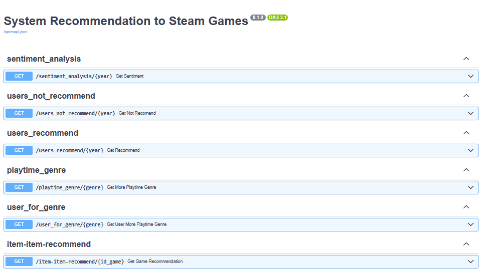

  

### **Steam** is a video game digital distribution service and storefront developed by Valve Corporation. It was launched as a software client in September 2003 to provide game updates automatically for Valve's games, and expanded to distributing third-party titles in late 2005. Steam offers various features, like game server matchmaking with Valve Anti-Cheat measures, social networking, and game streaming services. Steam client's functions include game update automation, cloud storage for game progress, and community features such as direct messaging, in-game overlay functions and a virtual collectable marketplace.

## Goal

Develop a recommendation system to give valuable reference to end costumer in his/her searching about similar games. Therefore, make available some metrics to STEAM by deploying an API.

#### Secondary goal

*   Preprocess the original dataset by using the Numpy and Pandas libraries, so that get more light and valuable data, i.e, make the ETL process

*   Show a data visualization by using Seaborn library to find patterns or information about the metrics, e.g, the most playtime by user or game and so on.

* Use render to deploy an API

## Data

The original datasets is not in this repository due its big size > 500MB. They are saved in a file in <a href="https://drive.google.com/drive/folders/1x2wj2gC2Ex9dw1S1Lv-UpDYhcYJgTQKz">Google Drive</a>.

## Process

*   ETL (Extraction, Transformation, Load). In order to achieve the goals the cleaning and necessary transformation (unnesting data) were done, so that getting clean and valuable data.

*   EDA (Exploratory Data Analysis). By using pandas, numpy and visualization tools get interesting information like the best users (more playtime or items), the best game.

*   A sentiment analysis was done with the aim to get a rating based in *negative*, *neutral* and *positive* review from the users.

*   Finally, by using the mathematical tools like dot product (cosine simmilarity) over the features *genres*, *specs* and *tags* we get a recommendation system.

## Product

The final product is showed below. Six functions return precious data about Steam business

  

Visit it on https://gamesteamrecommendation-pimlops.onrender.com

## Conclusions

*   We've taken the dirty data and got valuable data as much the user as Steam by executing the ETL and EDA
*   We have created a very optimize API by using FastAPI framework.
*   An API was deployed by using Git, Github and Render being the last a straightforward way to deploy any web services, but it has some limitations in the mode Free.
